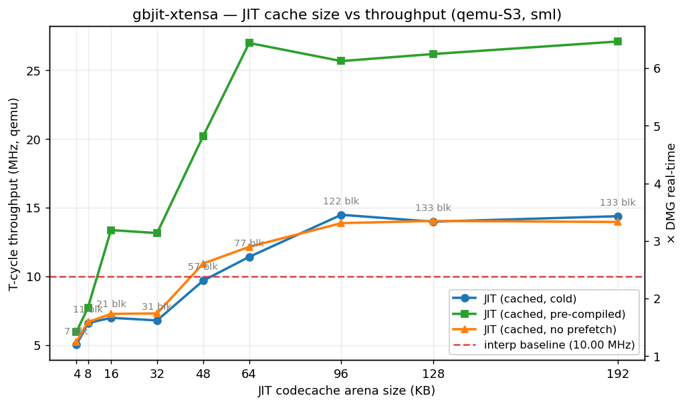

# gbjit-xtensa

A JIT-translating Game Boy CPU emulator targeting **ESP32-S3 / Xtensa
LX7**. GB instructions are compiled at runtime into native Xtensa
machine code; blocks live in IRAM via `MALLOC_CAP_EXEC` and are entered
through a CALL0 / windowed-ABI bridge.

Current scope is the **CPU phase**. The reference interpreter handles
the full SM83 ISA; the JIT inlines the hot opcodes (see the
[STATUS.md](STATUS.md) coverage table) and falls back to the
interpreter helper for the rest. 10 of the 11
[Blargg `cpu_instrs`](https://github.com/retrio/gb-test-roms)
sub-tests pass end-to-end through the JIT, both on the host pipeline
and on a real ESP32-S3 running under `qemu-system-xtensa`.

```
gbjit: [06-ld r,r] halted=1 pc=$CC5F cycles=50000000 elapsed=2049 ms
       blocks_compiled=102 blocks_executed=89294 chain_hits=84535 chain_misses=4759
       throughput = 24.48 MHz (T-cycles) = 5.84× DMG
gbjit: RESULT: PASS
```

**Super Mario Land runs on a real ESP32-S3 at 15.99 MHz / 3.81× DMG**
(JIT, cached, PPU on Core 1) — see
[`benchmark/results/esp32s3_sml`](benchmark/results/esp32s3_sml/)
for the head-to-head against the reference interpreter, the
correctness fixes (MBC1 bank-switch invalidation, OAM DMA, PPU-IO
write block break) that unblocked this path, and the async-PPU dual-
core design that gives a further +10 % on top.

> See [PLAN.md](PLAN.md) for the original design and
> [STATUS.md](STATUS.md) for the latest progress, benchmarks per ROM,
> and notes on outstanding work.

## JIT cache size vs throughput

Sweep of the JIT codecache arena size against SML's qemu-S3 throughput,
plotting three dispatcher modes side by side against the interpreter
baseline. Annotations on the cold-JIT line are unique blocks compiled
before the arena filled.



| Arena | jit (cold) | jit (pre-compiled) | jit (no prefetch) | Blocks |
|------:|-----------:|-------------------:|------------------:|-------:|
|  4 KB |  5.01 MHz | 5.96 MHz | 5.25 MHz | 7 |
|  8 KB |  6.60     | 7.73     | 6.67     | 11 |
| 16 KB |  6.98     | 13.37    | 7.27     | 21 |
| 32 KB |  6.79     | 13.15    | 7.30     | 31 |
| 48 KB |  9.69     | 20.21    | 10.94    | 57 |
| **64 KB (default)** | 11.42 | **27.00** | 12.15 | 77 |
| 96 KB | **14.49** | 25.68    | 13.88    | 122 |
| 128 KB| 13.98     | 26.20    | 14.04    | 133 |
| 192 KB| 14.38     | 27.11    | 13.96    | 133 |

Interpreter baseline: **10.00 MHz** / 2.38× DMG.

What the curves say:

- **jit (cold)** pays the on-the-fly compile cost during the measured
  window — flat-ish past 96 KB at ~14 MHz because the working set
  (133 blocks) fits comfortably and there's nothing more to compile.
- **jit (pre-compiled)** runs a warm-up pass first, then resets `cpu_
  state` and benches; the measured window contains zero compiles. Once
  the arena is ≥ 64 KB it converges to ~27 MHz (~2.7× interp), almost
  double the cold-start number — the compile cost is the gap.
- **jit (no prefetch)** is the cached path with the static-successor
  prefetch disabled, so each new block reaches the cache via a chain
  miss instead of a depth-4 walk at first compile. Tracks the cold
  curve closely; prefetch saves first-encounter latency more than
  steady-state throughput.
- **Under 48 KB every JIT mode falls below the interp.** The arena
  fills before SML's hot blocks are compiled, the dispatcher
  recompiles the same blocks, and per-call dispatcher overhead +
  recompile cost exceed the interp's per-op switch-table dispatch.

Reproduce: `benchmark/run_cache_sweep.sh` (parallel IDF builds,
then a worker-pool of qemu-xtensa runs pinned one-per-CPU via
`taskset -c` so each run's wall-clock-tied virtual timer is
uncontended) and `benchmark/plot_cache_sweep.py`.

## Quick start — host

```sh
sudo apt install build-essential cmake ninja-build python3            # one-time
cmake -B build -G Ninja -DCMAKE_BUILD_TYPE=Release
cmake --build build
ctest --test-dir build --output-on-failure                            # 6/6
```

Run a `.gb` ROM through the interpreter or the JIT (driven by the
in-tree Xtensa simulator):

```sh
./build/gbjit_host --interp --max-cycles 100000000 roms/06-ld_r_r.gb
./build/gbjit_host --jit    --max-cycles 100000000 roms/06-ld_r_r.gb
```

To fetch the Blargg sub-tests into `roms/`, see [roms/README.md](roms/README.md).

## Quick start — ESP32-S3 (qemu)

You need **ESP-IDF v6.x** with its bundled Xtensa toolchain and
`qemu-system-xtensa`. After running the IDF installer for the
`esp32s3` target:

```sh
. ~/.espressif/v6.0.1/esp-idf/export.sh
./scripts/run_qemu_s3.sh             # build + merge + qemu, exits 0 on PASS
```

The firmware embeds `06-ld_r_r.gb`, drives it through the JIT, and
prints throughput over UART.

To validate that the encoder emits the same bytes the IDF assembler
does:

```sh
./scripts/verify_encoder_vs_toolchain.sh
```

## Layout

```
core/                portable: SM83 interp, decoder tables, MMU
jit/                 portable: Xtensa LX7 encoder, codegen, code-cache,
                     dispatcher (incl. a small Xtensa sim used on host
                     to execute JIT output without real Xtensa)
port/host_linux/     CLI driver — `gbjit_host`
port/esp32s3/        ESP-IDF v6 project (component + main + sdkconfig)
tests/               ctest cases + manual stepwise-diff harness
scripts/             qemu runner + encoder-vs-toolchain validator
roms/                git-ignored; fetch script in roms/README.md
```

## Test inventory

```
$ ctest --test-dir build
    interp_smoke        — interp executes a hand-built ROM correctly
    encoder_smoke       — Xtensa encoder API sanity
    encoder_bits        — bit-exact output vs canonical Xtensa encodings
    xtensa_sim          — host sim executes encoder output
    jit_differential    — JIT cpu_state matches interpreter
                          over 4 hand-built ROMs + 1 loop ROM
    smc                 — invalidate-on-write correctness
```

Plus `tests/test_stepwise_diff <rom.gb>` — manual lockstep
interp/JIT comparator, used to bisect divergences when a real ROM
exposes a JIT bug.

## Notes

- **Why both an encoder and an in-tree simulator?** The host is x86; it
  can't execute the Xtensa bytes the JIT emits. The simulator (a small
  decoder written independently from the encoder) lets `ctest` actually
  *run* the generated code on every host build, catching encoder bugs
  long before the IDF image is even built. The simulator's coverage is
  limited to the subset of Xtensa the JIT emits.

- **JIT block ABI on target.** The JIT block runs under CALL0; IDF's C
  helpers are windowed. The bridge is in
  [`port/esp32s3/components/gbjit/jit_trampolines.S`](port/esp32s3/components/gbjit/jit_trampolines.S)
  and [`jit/dispatcher.c::enter_block_native`](jit/dispatcher.c). The
  JIT block *deliberately does not modify* `a1` — that breaks the
  window-overflow handler's spill-target calculation. The block's
  return PC is stashed in `cpu_state.jit_ret_pc` instead.

- **Known JIT-correctness limitation.** `02-interrupts.gb` checks
  cycle-accurate mid-block interrupt servicing. The JIT only services
  interrupts between blocks (not per op), so it can fail Blargg test
  #2 there. The reference interpreter also doesn't fully pass that ROM
  (it fails on the timer test, which the MMU stub doesn't implement
  yet). All other 10 sub-tests pass identically under interp and JIT.
